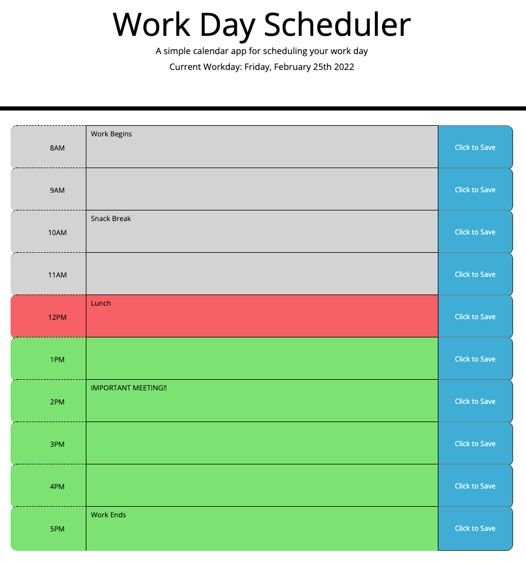

# Day Planner

## Description

The purpose of this project is to create a day planner consisting of typical day-time work hours. A user sees the current day displayed, and can input various activities by the hour. The activities are saved to localStorage, and when the user refreshes the day planner, their activities are still listed in each time slot.

## Features

- The current date displayed at the top of the page
- 10 hour-long time blocks where the user can input their schedule by hour
- Save button that when clicked, saves the inputted data to localStorage
- Red color indicates what hour of the day it currently is (if the current time falls within scheduled hours)
- Gray color indicates what hours of the day have already passed today
- Green color indicates what hours of the day are still to come today

## Link to Deployed Application

https://mfandel118.github.io/Day-Planner-Homework5/

## Link to GitHub Repo

https://github.com/mfandel118/Day-Planner-Homework5

## Screenshot

